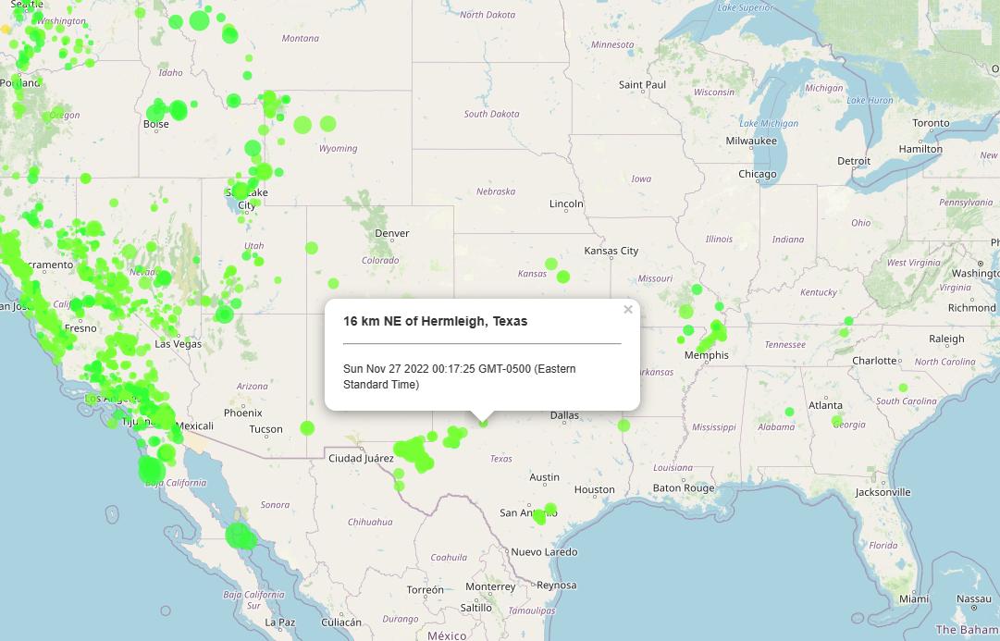
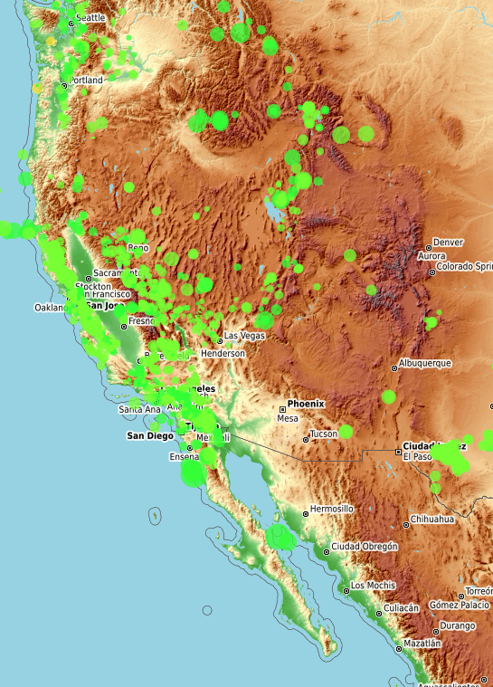
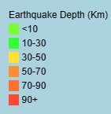

# leaflet-challenge

## Overview

In this repository, the user analyzed data from the United States Geological Survey (USGS). The data will serve to educate the pubulic and government organization on natrual hazard issues facing our planet, specifically, earthquakes.

## Analysis
HTML and JavaScript were utilized in this challenge in order to create the final visualization, an interactive map that represents the major earthquakes in the last 30 days. The map allows the viewer to traverse around the world on a street or topographic view and encounter circle markers that display where the earthquake occured and what time. The colors of the markers differ in the depth of the specific earthquake. A legend is located in the bottomright corner of the map that displays the earthquake depth in kilometers. 

## Results

